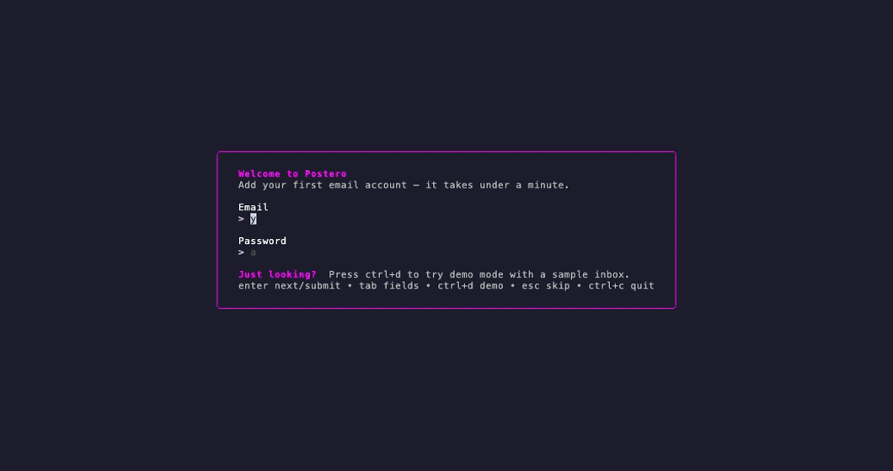

<p align="center">
  
</p>

<h1 align="center">Postero</h1>

<p align="center">
  Your inbox, keyboard-driven — a terminal-first email client in a single binary.<br />
  Read, triage, search, and compose mail with vim-style keys. No mouse, no browser.<br />
  Draft and reply with AI — a hosted model (Claude, OpenAI, Gemini) or a local agent you run (OpenClaw, Claude&nbsp;Code).
</p>

<p align="center">
  <a href="https://github.com/kriuchkov/postero/releases">
    
  </a>
  <a href="LICENSE">
    
  </a>
  <a href="go.mod">
    
  </a>
  
  
</p>

<p align="center">
  <a href="#ai-drafting--agents">
    
  </a>
  <a href="#ai-drafting--agents">
    
  </a>
  <a href="#ai-drafting--agents">
    
  </a>
</p>

<p align="center">
  <a href="#try-it-in-30-seconds"><strong>Try it</strong></a>
  <span>&nbsp;•&nbsp;</span>
  <a href="#features"><strong>Features</strong></a>
  <span>&nbsp;•&nbsp;</span>
  <a href="#quick-start"><strong>Quick Start</strong></a>
  <span>&nbsp;•&nbsp;</span>
  <a href="#navigation"><strong>Navigation</strong></a>
  <span>&nbsp;•&nbsp;</span>
  <a href="#commands"><strong>Commands</strong></a>
  <br />
  <a href="#configuration"><strong>Configuration</strong></a>
  <span>&nbsp;•&nbsp;</span>
  <a href="#secret-storage"><strong>Secrets</strong></a>
  <span>&nbsp;•&nbsp;</span>
  <a href="#architecture"><strong>Architecture</strong></a>
  <span>&nbsp;•&nbsp;</span>
  <a href="#license"><strong>License</strong></a>
</p>

<p align="center">
  
</p>

**Postero** (`pstr`) is a modern, open-source email client that lives in your terminal. Read, triage, search, compose, and send mail with vim-style keys — no mouse, no browser, one static binary.

## Try it in 30 seconds

No account, no config, nothing to sign up for — press one key and explore a sample inbox:

```bash
git clone https://github.com/kriuchkov/postero
cd postero
go run ./cmd/pstr        # or: make run
```

Postero opens a first-run wizard. Press **`Ctrl+d`** for **demo mode** — a sample inbox you can navigate, read, search, and compose in right away. It is fully in-memory: nothing is written to disk, and you can quit any time with `:q`.

The GIF above is exactly that flow: launch → `Ctrl+d` → browse the inbox, open a message, jump between folders (`gs` / `gi`), and open the composer.

When you're ready for real mail, adding an account takes under a minute — see [Quick Start](#quick-start).

## Features

Postero is built for developers, engineers, and command-line aficionados — it combines the power of a TUI with the clarity of a modern workflow.

Features include:

- **Intuitive text-based interface** - Reading, replying, forwarding, and organizing email from the terminal
- **Modern authentication** - IMAP/SMTP accounts with app passwords, `password_cmd`, native OS keychain storage, and built-in OAuth2 login
- **Fast search and MIME filters** - Keyboard-centric navigation with configurable HTML-to-text rendering
- **Interactive TUI** - Bubble Tea based workflow for inboxes, drafts, attachments, focused reading, and vim-style navigation
- **Keyboard-first workflow** - Built-in shortcuts for triage, search, compose, and pane navigation
- **Account-aware mail flow** - Per-account sync, compose, reply, and send flows from CLI and TUI
- **Composable drafts and attachments** - Save drafts locally, inspect attachments, and download them from the TUI
- **AI drafting, your choice of engine** - Generate compose/reply drafts with a hosted model (Claude, OpenAI, Gemini) or a **local agent** you run yourself (OpenClaw, Claude Code) so the content never leaves your machine — see [AI drafting & agents](#ai-drafting--agents)

## Quick Start

### Installation

#### Go Install

```bash
go install github.com/kriuchkov/postero/cmd/pstr@latest
```

#### Build from Source

```bash
go build -o pstr ./cmd/pstr
```

#### Download Binary

Download the latest release from the [Releases](https://github.com/kriuchkov/postero/releases) page.

### Basic Usage

Start Postero:

```bash
pstr
```

Running `pstr` without subcommands opens the interactive TUI.

### First Run

On the first launch (no accounts configured) Postero opens a setup wizard right in the TUI:

1. Type your email — the provider (Gmail, Outlook, Yahoo, iCloud, Fastmail, Yandex) is detected from the domain, with IMAP/SMTP hosts, ports and TLS filled in automatically. Unknown domains ask for the two hosts.
2. Type your app password — it is stored in the OS keychain, never in the config file.
3. Press Enter — the account is saved and your inbox syncs immediately.

Run `:setup` inside the TUI any time to add another account, or press `Esc` to skip the wizard. Just looking? Press `Ctrl+d` (or run `:demo`) for [demo mode](#try-it-in-30-seconds) — a sample inbox, no account required.

Sync mailbox:

```bash
pstr sync
```

Search emails:

```bash
pstr search "subject:golang"
```

Compose new email:

```bash
pstr compose
```

Generate a compose or reply draft with AI using configured templates:

```bash
pstr compose ai --account Gmail --to user@example.com --instruction "Draft a short project kickoff email"
pstr reply ai msg-001 --template reply-default --instruction "Politely accept and ask for the agenda" --all
```

## Navigation

The TUI is keyboard-first and now supports vim-style movement across the sidebar, message list, reader pane, and composer.

### Global Movement

- `h` / `l` or `←` / `→` - Move focus between sidebar, message list, and reader pane
- `Ctrl+h` - Cycle focus through sidebar → list → reader and back around
- `j` / `k` or `↓` / `↑` - Move within the active pane
- Prefix motions with counts such as `5j`, `3gg`, or `2G` to move multiple rows or jump to a specific visible item
- `gg` or `Home` - Jump to the top of the active pane
- `G` or `End` - Jump to the bottom of the active pane
- `0` - Jump to the start of the active pane
- `$` - Jump to the end of the active pane
- `Ctrl+u` / `Ctrl+d` - Half-page up or down
- `PgUp` / `PgDn` or `Ctrl+b` / `Ctrl+f` - Full-page movement

### Search And Mailbox Flow

- `/` - Start live search in the current mailbox
- `n` / `N` - Jump to the next or previous search hit
- `*` - Search the mailbox for messages from the selected sender
- `#` - Search the mailbox for messages matching the selected subject (Re:/Fwd: prefixes stripped)
- `Enter` - Keep the current filtered result or open the selected draft
- `Esc` - Clear the active search or clear account scoping from the sidebar

### Goto Shortcuts

- `gi` / `gs` / `gd` - Jump to Inbox, Sent, or Drafts
- `ga` / `gt` / `g!` - Jump to Archive, Trash, or Spam

### Visual Mode

- `V` - Start visual selection in the message list; `j`/`k`, counts, and `gg`/`G` extend the range
- `d` / `a` / `!` - Trash, archive, or mark the whole selection as spam (undo with `u`)
- `m` - Mark the selection as read
- `Esc` / `V` / `q` - Leave visual mode without acting

### Yank

- `yy` - Copy the selected message body to the system clipboard
- `ys` / `yf` - Copy the subject or the sender address

### Message Actions

- `c` - Compose a new message
- `r` - Reply
- `R` - Reply all
- `f` - Forward
- `d` - Move to trash, or permanently delete in Trash
- `a` - Archive
- `!` - Mark as spam
- `.` - Repeat the last archive, trash, spam, or permanent delete action on the current selection
- `u` - Undo the last delete, archive, or spam action while the undo window is active
- `s` - Save attachments from the selected message to `~/Downloads`

### Command Mode

- `:` - Open the command palette
- Supported commands: `compose`, `compose-ai`, `reply-ai`, `reply-all-ai`, `inbox`, `sent`, `drafts`, `archive`, `trash`, `spam`, `refresh`, `help`, `quit`
- AI commands open the normal composer with generated content, for example `:compose-ai Draft a short kickoff email`, `:compose-ai --template compose-default Draft a short kickoff email`, or `:reply-ai --template reply-default Politely accept and confirm`
- While AI generation is in flight, the header and footer show a dedicated loading badge so network-backed draft generation is visible
- While a compose draft has unsaved changes, commands that would abandon it are blocked until you save, send, or cancel it

### Compose Mode

Compose has a normal mode for navigation and a writing mode for text entry.

- `j` / `k` - Move between Account, To, Subject, and Body while in normal mode
- `h` / `l` or `←` / `→` on the Account field - Switch the sending account
- Counts also work in compose normal mode, for example `2j`, `3gg`, or `G`
- `gg`, `G`, `0`, `$` - Jump to the first or last compose field
- `i` or `Enter` - Enter writing mode for the selected field
- `:` - Open the command palette from compose, including AI drafting commands such as `compose-ai --template compose-default ...`
- `Esc` - Leave writing mode; press `Esc` again to cancel compose
- `Ctrl+o` - Save draft
- `Ctrl+x` - Send message
- `:w` / `:wq` / `:x` - Save the draft (and close with `wq`/`x`)
- `:q` - Close compose (blocked while the draft has unsaved changes)
- `:q!` - Discard the draft and close
- `:send` - Send the message

## Configuration

Postero supports a flexible configuration system using YAML files and environment variables.

**Priority Order:**

1. Command-line flags
2. Environment variables
3. Configuration file (`~/.config/postero/config.yaml` or `./config.yaml`)
4. Default values

### Configuration File

Example `~/.config/postero/config.yaml`:

```yaml
accounts:
  - name: "personal"
    provider: "gmail"
    email: "user@example.com"
    username: "user@example.com"
    # For common providers, Postero fills IMAP/SMTP defaults automatically.
    # Passwords are NEVER stored in this file — use the OS keychain
    # (`pstr auth set`) or a password_cmd that fetches from a store.
    imap:
      # password_cmd: ["pass", "show", "email/personal-imap"]
    smtp:
      # password_cmd: ["pass", "show", "email/personal-smtp"]
    # Optional shared password_cmd if IMAP/SMTP secrets are the same
    # password_cmd: ["pass", "show", "email/personal"]
    oauth2:
      client_id: "your-client-id"
      # The client secret is NOT stored here. Save it with
      # `pstr auth set-secret personal`, or set:
      # client_secret_cmd: ["pass", "show", "oauth/personal-client-secret"]

filters:
  # Render HTML emails using w3m
  text/html: "w3m -T text/html -dump"
  # Optional plain text post-processing
  # text/plain: "sed -e 's/\\r$//'"

tui:
  # Messages fetched per page in the interactive list and search results.
  list_page_size: 30
  # How close the cursor gets to the bottom before the next page is fetched.
  list_prefetch_ahead: 5
  # Spinner frame interval for loading indicators, in milliseconds.
  loading_tick_ms: 120
```

If `username` is omitted, Postero uses `email` as the login.

For common public providers, `provider: "gmail"` and `provider: "outlook"` prefill the standard IMAP/SMTP hosts, ports, TLS, and OAuth2 defaults.

### AI drafting & agents

Compose and reply drafts can be generated by AI. A **template** (`ai.templates`) renders the message context and points at a **provider** (`ai.providers`); each provider has a `type`:

| `type` | Kind | What it is |
| --- | --- | --- |
| `openai` | Hosted API | OpenAI Chat Completions |
| `gemini` | Hosted API | Google Gemini |
| `anthropic` (or `claude`) | Hosted API | Claude via the Anthropic Messages API |
| `command` | **Local agent** | Runs any CLI (argv, no shell): prompt on stdin, reply on stdout — e.g. **Claude Code** (`["claude","-p"]`) |
| `openclaw` | **Local agent** | Preset for **OpenClaw** (`openclaw agent exec`) |

Hosted providers send the message body over HTTPS (non-HTTPS endpoints are refused); the key lives in the OS keychain (`pstr auth set-ai <provider>`) or an `api_key_cmd`. **Local agent providers run a CLI on your own machine, so the content never leaves it** — no API key needed.

```yaml
ai:
  default_reply_template: "reply-default"
  providers:
    anthropic:
      type: "anthropic"
      model: "claude-opus-5"       # key: pstr auth set-ai anthropic
    openclaw:
      type: "openclaw"             # local agent; command defaults to `openclaw agent exec`
    agent:
      type: "command"
      command: ["claude", "-p"]    # Claude Code, opencode, or any local agent CLI
  templates:
    reply-default:
      mode: "reply"
      provider: "openclaw"         # or "anthropic" / "agent"
      prompt: |
        Draft a reply. Instruction: {{ .Instruction }}
        Original from: {{ .Original.From }}
        {{ .Original.Body }}
```

Trigger it from the TUI (`:reply-ai`, `:compose-ai`, or the `r`-then-AI flow) or the CLI (`pstr reply ai …`, `pstr compose ai …`). See [`postero.yaml.example`](postero.yaml.example) for a fuller AI section.

### Secret storage

Postero keeps every secret out of `config.yaml`. There are exactly two places a secret can live:

- the **OS keychain** (macOS Keychain, Linux Secret Service, Windows Credential Manager), or
- the output of a **`*_cmd`** you configure (e.g. `pass`, `gpg`, a vault CLI).

Environment variables are **not** a secret source — they leak through `/proc/<pid>/environ` and are inherited by child processes.

A `*_cmd` must **fetch** the secret from a store — it must never contain a literal secret as an argument (that would expose it in the process list, `ps`). Postero rejects `echo`/`printf`/`print` commands at config validation for this reason. Use `pass show …`, `security find-generic-password …`, `secret-tool lookup …`, or `gpg -d …`.

| Secret | Keychain writer | Command alternative |
| --- | --- | --- |
| Mailbox password | `pstr auth set <account>` (or the setup wizard) | `password_cmd` (per account or per protocol) |
| AI provider API key | `pstr auth set-ai <provider>` | `api_key_cmd` |
| OAuth2 client secret | `pstr auth set-secret <account>` (or `auth add`/`auth login` flags) | `client_secret_cmd` |
| OAuth2 tokens | stored automatically after `pstr auth login` | — |

For IMAP/SMTP passwords the resolution order is: refreshed OAuth2 token (for `auth_type: oauth2`) → `password_cmd` → OS keychain.

Any legacy inline secret still present in the file (`password:`, `api_key:`, `client_secret:`) is **ignored on load with a one-line warning** — move it to the keychain or a `*_cmd`. If the OS keychain is unavailable (e.g. a headless session), the setup wizard refuses to save rather than fall back to plaintext; configure a `*_cmd` instead.

Non-secret TUI settings can still be overridden via env vars, for example `POSTERO_TUI_LIST_PAGE_SIZE=50`, `POSTERO_TUI_LIST_PREFETCH_AHEAD=8`, `POSTERO_TUI_LOADING_TICK_MS=90` (these map to the keys under `tui:`).

### Transport & on-disk security

- **TLS is required for real servers.** IMAP and SMTP connections verify the server certificate (TLS 1.2+, hostname checked). With `tls: false`, or if a server does not offer STARTTLS when TLS is requested, Postero **refuses** to send your password or mail rather than transmitting them in cleartext. Plaintext is permitted only for loopback hosts (`localhost`/`127.0.0.1`) for local testing. Provider presets always use TLS.
- **Local data is owner-only.** The process runs with a `0077` umask, so the config file, the SQLite database (including its `-wal`/`-shm` sidecars) and saved attachments are created `0600` in `0700` directories — not readable by other local users. Attachments are saved to `~/Downloads` without overwriting existing files.
- **AI drafting is opt-in and provider-aware.** It runs only when you invoke an AI command with a configured template. A *hosted* provider (OpenAI, Google Gemini, Anthropic Claude) sends the message body to that third party over HTTPS (non-HTTPS AI endpoints are refused); a *local* agent provider (`type: command` / `openclaw` — e.g. OpenClaw or Claude Code) runs a CLI on your own machine, so the content never leaves it. It is off entirely unless you configure a provider.

If `imap.username` or `smtp.username` is omitted, Postero falls back to `username`, then to `email`.

`sync` and `compose --send` now use the configured IMAP/SMTP servers directly and return a clear error if credentials are missing.

Useful auth and config commands:

```bash
pstr config init gmail
pstr config validate
pstr auth add personal --provider gmail --email user@example.com
pstr auth set personal
pstr auth login personal
pstr auth delete personal
```

`pstr auth add` saves or updates an account entry in `config.yaml`. `pstr auth login` performs the OAuth2 code exchange inside Postero, stores the resulting token in the OS keychain, and can also bootstrap missing OAuth client settings from CLI flags.

## Commands

### Main Commands

- `pstr` - Launch the interactive terminal UI
- `sync` - Synchronize emails with IMAP server
- `search` - Search emails by subject, sender, or content
- `show` - Print one message with headers, labels, attachments, and body
- `compose` - Create and send new email
- `reply` - Reply to selected email
- `forward` - Forward email
- `list` - Print a mailbox snapshot to stdout
- `read` - Mark a message as read
- `star` - Toggle the starred state of a message
- `archive` - Move a message out of Inbox into Archive
- `trash` - Mark a message as trashed without deleting it permanently
- `delete` - Permanently remove a message from the local store
- `spam` - Mark a message as spam

`auth` subcommands manage saved credentials and OAuth2 logins:

- `auth set <account>` - Save a mailbox password in the OS keychain
- `auth set-ai <provider>` - Save an AI provider API key in the OS keychain
- `auth set-secret <account>` - Save an OAuth2 client secret in the OS keychain
- `auth add <provider>` - Create or update a provider-backed account in `config.yaml` (client secret goes to the keychain)
- `auth login <account>` - Run the built-in OAuth2 login flow and save the token in keychain
- `auth delete <account>` - Remove stored credentials (password, OAuth token, client secret) for the account

`config` subcommands help initialize and validate YAML configuration:

- `config init <provider>` - Print a starter config snippet for a known provider
- `config validate` - Check the loaded config and print actionable validation hints

`compose`, `reply`, `forward`, and `sync` support `--account` so you can explicitly choose the configured account by name or email.

`compose ai` and `reply ai` use `ai.providers` and `ai.templates` from the config file. Templates are rendered with compose/reply context and must return JSON with `subject` and `body`. Use `--instruction` for the high-level request and `--var key=value` for extra template data.

`list` supports mailbox and output filters such as `--mailbox`, `--label`, `--limit`, and `--format`. `search` supports `--account`, `--label`, `--limit`, `--unread`, and `--format` for scripting-friendly usage.

Message action commands such as `read`, `star`, `archive`, `trash`, `spam`, and `delete` accept multiple IDs and can read IDs from stdin with `--stdin-ids` for shell pipelines. `trash` is reversible mailbox state, while `delete` permanently removes messages from the local store.

Examples:

```bash
pstr sync --account Outlook
pstr list --mailbox archive --limit 10
pstr search invoice --account Gmail --unread
pstr show msg-001
pstr compose --account Gmail --to user@example.com --subject "Hello" --attach ./invoice.pdf
pstr reply msg-001 --account Gmail --all --send
pstr trash msg-001 msg-002
pstr search invoice --format json | jq -r '.[].id' | pstr archive --stdin-ids
pstr delete msg-999
pstr archive msg-001
```

## Architecture

Postero follows Clean Architecture principles with a clear separation of concerns:

- **Entities/Models** - Core email message types
- **Use Cases/Services** - Business logic for email operations
- **Interface Adapters** - Grouped by responsibility: commands, mail, storage, and UI
- **Frameworks** - Cobra for CLI, Bubble Tea for TUI

### Directory Structure

```text
postero/
├── cmd/
│   └── pstr/
│       └── main.go
├── internal/
│   ├── adapters/
│   │   ├── commands/
│   │   │   └── cli/      # Cobra commands and CLI entrypoints
│   │   ├── mail/
│   │   │   ├── imap/     # IMAP transport adapter
│   │   │   └── smtp/     # SMTP transport adapter
│   │   ├── storage/
│   │   │   ├── file/     # JSON file-backed storage adapter
│   │   │   └── sqlite/   # SQLite-backed storage adapter
│   │   └── ui/
│   │       └── tui/      # Bubble Tea terminal UI
│   ├── app/              # Runtime wiring and factories
│   ├── config/           # Configuration management
│   ├── core/
│   │   ├── models/       # Domain models plus service request/response types
│   │   ├── errors/       # Domain errors
│   │   └── ports/        # Interfaces
│   └── services/
│       └── message/      # Email operations service
└── go.mod
```

Runtime wiring supports both SQLite and file-backed storage through `storage.backend`. Use `sqlite` for the default database-backed mode or `file` for JSON-on-disk storage.

## License

GPL-3.0-or-later
